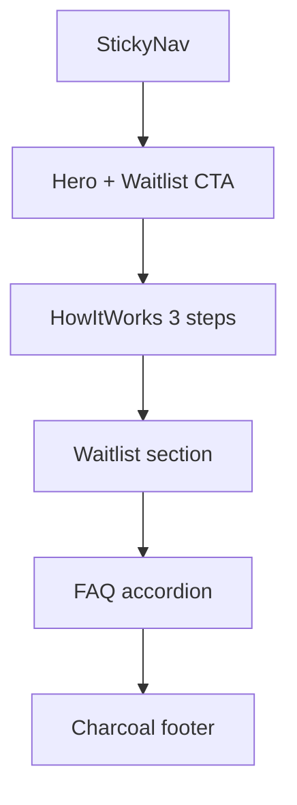

# PowerSell Marketing Landing Page

## Goal

Build a concise, light-mode React marketing site for **PowerSell** (AI Sales Enablement) in this workspace, matching the reference app’s design system at [`/Users/kaan/.superset/projects/PowerSell/`](/Users/kaan/.superset/projects/PowerSell/), with waitlist, How it Works, and FAQ. All visual tokens live in one editable design-system source so colors, radii, and type can be changed without hunting through components.

## Location & stack

- **Where**: this repo ([`/Users/kaan/Cursor/Cursor-Demo-July`](/Users/kaan/Cursor/Cursor-Demo-July)), as a standalone Vite app at the repo root (repo is currently empty aside from Cursor config).
- **Stack**: Vite + React 18 + TypeScript + Tailwind CSS (same styling approach as PowerSell; no Next.js app shell or auth/workflow code).
- **Reference only**: PowerSell tokens/copy/patterns; do not modify the PowerSell app.

## Design system (single edit surface)

Port PowerSell’s tokens from [`src/styles/globals.css`](/Users/kaan/.superset/projects/PowerSell/src/styles/globals.css) and marketing hex usage into one place:

| Token | Value | Role |
|-------|--------|------|
| Cream canvas | `#F9F6EE` | Page background |
| Charcoal | `#343434` | Headings, footer |
| Viridian | `#40826D` | Primary / CTAs / accents |
| Primary hover | `#366a59` | Button hover |
| White | `#FFFFFF` | Surfaces, nav |
| Radius | `0.5rem` | Controls and panels |

**Editability approach:**

1. [`src/design-system/tokens.css`](src/design-system/tokens.css) — CSS variables (`--color-primary`, `--color-canvas`, `--radius`, `--font-sans`, spacing scale).
2. [`src/design-system/tokens.ts`](src/design-system/tokens.ts) — typed mirror of those values (copy, section spacing, FAQ items, waitlist strings) so content and design knobs are co-located.
3. [`tailwind.config.ts`](tailwind.config.ts) — map Tailwind colors/radii to `var(--…)` only (no scattered `#40826D` in components).
4. Components consume semantic classes (`bg-canvas`, `text-foreground`, `bg-primary`) never raw brand hex.

Changing the brand look = edit `tokens.css` (+ optional content in `tokens.ts`). No in-page design editor.

**Typography:** Keep PowerSell’s weight/size hierarchy (hero ~`text-5xl font-bold`, sections `text-3xl`, body muted slate). Use a restrained sans pair loaded via Google Fonts that still feels product-like (e.g. **DM Sans** for UI + **Source Serif 4** only if needed for brand wordmark — default is a single distinctive sans, not Inter/Roboto/Arial). Light mode only; no theme toggle.

## Page structure (concise, one job per section)



1. **Nav** — Wordmark `PowerSell`, subtitle `AI Sales Enablement`, anchor links (How it Works, Waitlist, FAQ). Sticky white bar, soft green border — same pattern as PowerSell’s header.
2. **Hero** — Brand-first: `PowerSell` as hero-level signal, headline from existing copy (“Supercharge Your **Sales Process** With AI”), one supporting sentence, single waitlist CTA group (email + Join Waitlist). Optional lightweight product mock (skeleton bars + green avatars) on desktop only, matching the existing mock in PowerSell’s `index.tsx` — not a card-heavy dashboard.
3. **How it Works** — Reuse the three steps from PowerSell:
   - Research & Analysis
   - Product Matching
   - Personalized Outreach  
   Numbered viridian circles, white panels on `primary/5` band, `shadow-sm` / hover `shadow-md`.
4. **Waitlist** — Dedicated section with email field, submit, success/error states. Client-side validation; persist signups to `localStorage` and expose a small `submitWaitlist(email)` helper ready to swap for an API later. No backend in v1.
5. **FAQ** — 4–6 short Q&As (what it is, who it’s for, how AI agents work, waitlist timing, data privacy at a high level). Accordion (native `<details>` or a tiny Radix-free disclosure) to stay light.
6. **Footer** — Charcoal `#343434` bar, “AI-powered sales enablement”, year.

Motion: 2–3 light touches only (staggered hero fade-in, subtle step hover, FAQ open/close) — CSS transitions, no heavy animation library.

## Key files to create

```
package.json
vite.config.ts
tsconfig.json
tailwind.config.ts
postcss.config.js
index.html
src/main.tsx
src/App.tsx
src/index.css                 # imports tokens + Tailwind
src/design-system/tokens.css  # editable design tokens
src/design-system/tokens.ts   # content + typed token refs
src/components/Nav.tsx
src/components/Hero.tsx
src/components/HowItWorks.tsx
src/components/WaitlistForm.tsx
src/components/Faq.tsx
src/components/Footer.tsx
src/lib/waitlist.ts           # validation + localStorage
public/favicon.png            # copy from PowerSell public/favicon.png
```

## Content source

Pull marketing voice from PowerSell’s existing landing ([`src/pages/index.tsx`](/Users/kaan/.superset/projects/PowerSell/src/pages/index.tsx)):

- Title: PowerSell - AI Sales Enablement
- Hero line + body as above
- Three-step How it Works copy as above
- FAQ written to match that product story (four AI agents: Company Profiler, Pain Point Analyzer, Product Matcher, Outreach Generator) without bloating the page

## Out of scope

- Auth, dashboard, or workflow start form from the app
- Backend / Supabase waitlist API (structure only for future hookup)
- Dark mode
- Changes inside the PowerSell repository

## Repo polish (after landing ships)

Run the [git-repo-polish](.claude/skills/git-repo-polish/SKILL.md) skill on this repo once the Vite app exists. Focus on a strong public README and light foundation polish — not a full open-source release sweep unless the files are clearly useful.

**README must cover:**

- What PowerSell landing is (marketing waitlist site for AI Sales Enablement)
- Stack (Vite, React, TypeScript, Tailwind)
- How to run (`npm install`, `npm run dev`, `npm run build`)
- How to edit the design system (`src/design-system/tokens.css` / `tokens.ts`)
- Link/reference to the product app path for context (read-only)

**Also add if missing and appropriate:**

- `.gitignore` for Vite/Node
- `LICENSE` only if the repo should declare one (match existing GitHub remote norms; do not invent legal terms)
- Short `CONTRIBUTING.md` only if it clarifies local setup
- Pass README (and any new markdown) through the no-dash-copy-editor conventions from the polish skill

Do not invent features, waitlist backend claims, or security guarantees. Keep docs specific to what was actually built.

## Validation

- `npm install` && `npm run dev` — page loads light cream canvas, viridian CTAs
- Desktop + mobile: hero readable, sections stack cleanly
- Waitlist: invalid email rejected; valid email shows success and is stored
- Changing `--color-primary` in `tokens.css` updates buttons, accents, and step numbers site-wide
- README accurately describes setup, design-token editing, and project purpose

## Completion Log

- **Date completed**: 2026-07-22
- **Commit range**: 9530e5c..99b8bd0 (initial build, 11 tiered commits), plus follow-up copy and plan-status commits
- **Deviations**:
  - Hero reworked at user request after the initial build: waitlist form removed from the hero in favor of a single anchor CTA; product skeleton mock replaced with a four-agent pipeline visual (Company Profiler, Pain Point Analyzer, Product Matcher, Outreach Generator); dedicated waitlist section moved below the FAQ to close the page.
  - Typography extended with Source Serif 4 as a display face alongside DM Sans.
  - Primary tints derive from `--color-primary` via `color-mix`, so one token edit rebrands accents, bands, and borders.
  - Page copy passed through no-dash-copy-editor at user request (em dashes removed, "AI-powered" and "well-qualified" modifiers replaced).
  - `node_modules/` and `dist/` had been tracked by an auto-commit hook; local unpushed commits were soft-reset and both directories untracked before the tiered commit sweep.
  - LICENSE and CONTRIBUTING intentionally omitted: no license norm existed on the remote, and the README quick start covers local setup.
